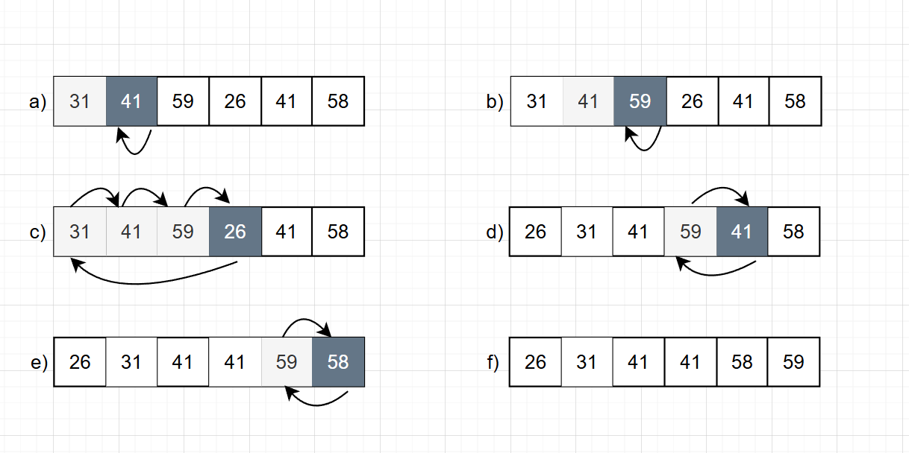

# 2.1 Insertion sort

## 2.1-1

> Using Figure 2.2 as a model, illustrate the operation of $\text{INSERTION-SORT}$ on the array $A = \langle 31, 41, 59, 26, 41, 58 \rangle$.



as shown in the figure above, the array A change as follow
$$
\begin{aligned}
A = \langle 31, 41, 59, 26, 41, 58 \rangle\cr
A = \langle 31, 41, 59, 26, 41, 58 \rangle\cr
A = \langle 26, 31, 41, 59, 41, 58 \rangle\cr
A = \langle 26, 31, 41, 41, 59, 58 \rangle\cr
A = \langle 26, 31, 41, 41, 58, 59 \rangle\cr
A = \langle 26, 31, 41, 41, 58, 59 \rangle\cr
\end{aligned}
$$

## 2.1-2

> Consider the procedure SUM-ARRAY on the facing page. It computes the sum of
the n numbers in array $A[1:n]$. State a loop invariant for this procedure, and use
its initialization, maintenance, and termination properties to show that the SUMARRAY procedure returns the sum of the numbers in $A[1:n]$.
>
> ```cpp
> SUM-ARRAY(A,n)
> sum = 0
> for i = 1 to n
>   sum = sum + A[i]
> return sum
> ```

- **Loop invariant**: At the start of the *i*th iteration of the **for** loop, the equation $sum = \sum_{j=1}^{i-1} A[j]$ holds.
- **Initialization**: Before the first iteration (i=1), $sum = \sum_{j=1}^{0} A[j] = 0$ holds.
- **Maintenance**: During the *i*th iteration, `sum = sum + A[i]` results $sum = \sum_{j=1}^{i-1} A[j] + A[i] = \sum_{j=1}^{i} A[j]$, at the end of this iteration, Incrementing *i* for the next iteration of the for loop then preserves the loop invariant.
- **Termination**: The loop terminates when $i > n$, since *i* increase 1 at each iteration, $i=n+1$ at termination.$sum = \sum_{j=1}^{i-1} A[j]=\sum_{j=1}^{n} A[j]$ holds.

## 2.1-3

> Rewrite the **INSERTION-SORT** procedure to sort into monotonically decreasing instead of monotonically increasing order.

```cpp
INSERTION_SORT_NONINCEASE(A)
  for i=2 to A.length()
    key = A[i]
    j = i -1
    while j >=1 and A[j] > key
      A[j+1] = A[j]
    A[j+1] = key 
```

## 2.1-4

> Consider the **searching problem**:
>
> **Input**: A sequence of n numbers $\langle a1 , a2,..., an \rangle$stored in array A[1:n] and a value x.
>
> **Output**: An index i such that x equals $A[i]$ or the special value NIL if x does not appear in $A$.
>
> Write pseudocode for **linear search**, which scans through the array from beginning to end, looking for x. Using a loop invariant, prove that your algorithm is correct. Make sure that your loop invariant fulfills the three necessary properties.

```C++
LINEAR_SEARCH (A,x)
  for i = 1 to A.length()
    if A[i] == x 
      return i
    return NIL
```

- **Loop invariant**: At the start of the *i*th iteration of the **for** loop, no element in the subarray $A[1:i-1] equal $x$
- **Initialization**: Before the first iteration (i=1), $A[1:0]$ is empty, so no elements in $A[1:0]$ eqaul $x$
- **Maintenance**: During the *i*th iteration, if $A[i]==x$ , the algorithms return the correct answer $i$.Otherwise, i increases $1$ and no element in $A[1:i]$ equal $x$, at the start of the *i*th iteration. Incrementing *i* for the next iteration of the for loop then preserves the loop invariant.
- **Termination**: The loop terminates when $i > n$, since *i* increase 1 at each iteration, $i=n+1$ at termination. No element in $A[1:i-1]=A[1:n]$ equal $x$.

## 2.1-5

> Consider the problem of adding two *n*-bit binary integers $a$ and $b$, stored in two $n$-element arrays $A[0:n-1]$ and $B[0:n-1]$, where each element is either $0$ or $1$. $a = \sum_{i=0}^{n-1} A[i] \cdot 2^i$, and $b = \sum_{i=0}^{n-1} B[i] \cdot 2^i$. The sum $c = a + b$ of the two integers should be stored in binary form in an ($n+1$)-element array $C[0:n]$, where $c = \sum_{i=0}^{n} C[i] \cdot 2^i$. Write a procedure **ADD-BINARY-INTEGERS** that takes as input arrays $A$ and $B$, along with the length n, and returns array **C** holding the sum.

```C++
ADD_BINARY_INTEGERS(A,B,n)
    C[0:n]
    carry=0
    for i = 1 to n
        C[i-1]=(A[i]+B[i]+carry)%2
        carry =(A[i]+B[i]+carry)/2
    C[n] = carry
    return C;
```
