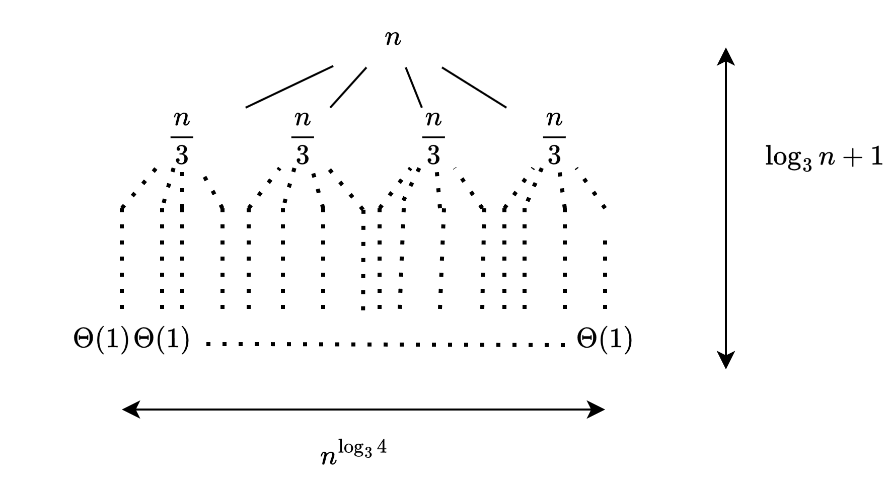
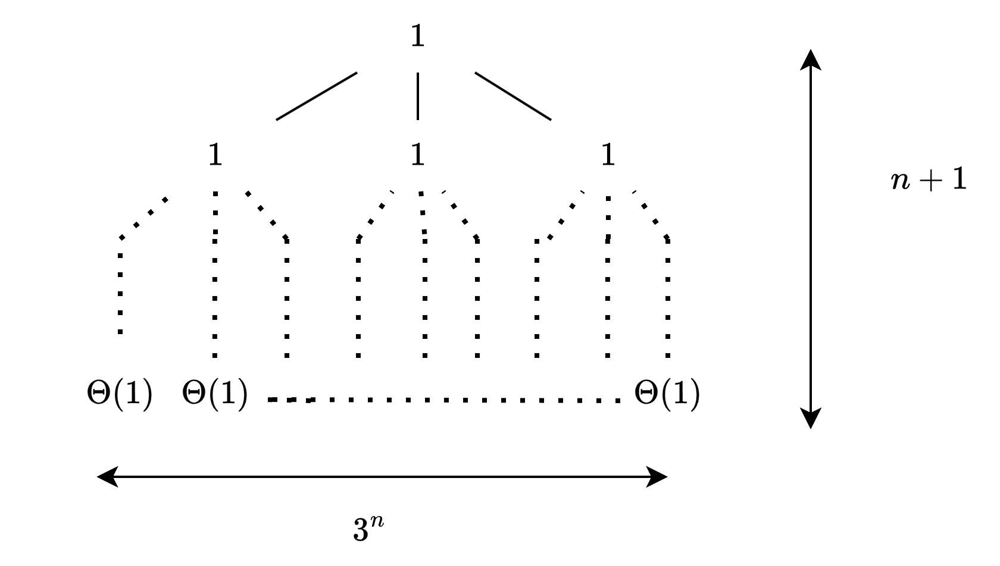

# 4.4 The recursion-tree method for solving recurrences

## 4.4-1

> For each of the following recurrences, sketch its recursion tree, and guess a good asymptotic upper bound on its solution. Then use the substitution method to verify your answer.
>
> **a**. $T(n)=T(n/2)+n^3$.
>
> **b**. $T(n) = 4T(n/3)+n$.
>
> **c**. $T(n) = 4T(n/2)+n$.
>
> **d**. $T(n) = 3T(n-1)+1$.

**a**.

guess $T(n)=O(n^3)$,assume $T(n)\leq cn^3$

$$
\begin{aligned}
    T(n) & = T(n/2)+n^3\cr
    & \leq \frac{cn^3}{8}+n^3\cr
    & \leq (1+\frac{c}{8})n\cr
    & \leq cn^3\cr
\end{aligned}
$$

the last step holds for $c\geq 7/8$

**b**.

guess $T(n)=O(n^{\log_{3} 4})$, assume $T(n)\leq cn^{\log_3 4}-dn$

$$
\begin{aligned}
    T(n) & =4T(n/3)+n\cr
    & \leq cn^{\log_{3} 4} -\frac{4dn}{3}+ n\cr
    & \leq cn^{\log_{3} 4}\cr
\end{aligned}
$$

the last step holds for $d\geq 4/3$

**c**.

guess $T(n)=O(n^2)$, assume $T(n)\leq cn^2-dn$

$$
\begin{aligned}
    T(n) & =4T(n/2)+n\cr
    & \leq cn^2-2dn+n\cr
    & \leq cn^2\cr
\end{aligned}
$$

the last step holds for $d\geq 1/2$

**d**.

guess $T(n)=O(3^n)$, assume $T(n)\leq c3^n-d$

$$
\begin{aligned}
    T(n) & =3T(n-1)+1\cr
    & \leq 3\cdot 3^{n-1}-3d +1\cr
    & \leq 3^n\cr
\end{aligned}
$$

the last step holds for $d\geq 1/3$

## 4.4-2

> Use the substitution method to prove that recurrence (4.15) has the asymptotic lower bound $L(n)=\Omega(n)$. Conclude that $L(n)=\Theta(n)$.

assume$L(n)\geq cn$

$$
\begin{aligned}
    L(n) & =L(n/3)+L(2n/3)\cr
    & \geq c(n/3)+c(n2/3)\cr
    & = cn\cr
\end{aligned}
$$

since the textbook has proved that $L(n)=O(n)$, and now $L(n)=\Omega(n)$ is proved, we can conclude that $L(n)=\Theta(n)$.

## 4.4-3

> Use the substitution method to prove that recurrence (4.14) has the solution $T(n) = \Omega(n\lg n)$. Conclude  that $T(n)=\Theta(n\lg n)$.

guess $T(n)\leq cn\lg n$

$$
\begin{aligned}
    T(n) & =T(n/3)+T(2n/3)+\Theta(n)\cr
    & \leq c(n/3)\lg(n/3)+c(2n/3)\lg(2n/3)+dn\cr
    & = cn\lg{n}-\frac{cn}{3}(3\lg{3}-2-3d/c)\cr
    & \leq cn\lg{n}\cr
\end{aligned}
$$

the last step holds for $c\geq 3d/2$.

## 4.4-4

> Use a recursion tree to justify a good guess for the solution to the recurrence $T(n)=T(\alpha n)+T((1-\alpha)n)+\Theta(n)$, where $\alpha$ is a constant in the range $0 < \alpha 1$.

assume $\alpha<1/2$, since otherwise let $\beta=1-\alpha =$ and solve it for $\beta$.

let $L(n)$ donates leaves number, then $L(n)=L(\alpha n)+L((1-\alpha)n)\implies L(n)=\Theta(n)$

the smallest depth of leaves is $\log_{1/\alpha}n$, while the largest depth is $\log_{\alpha}n$, total cost over all nodes at depth $i$, for $i=0,1,\dots,\log_{1/\alpha}n-1$ is $\Theta(n)$

$$
\begin{aligned}
    & \sum_{i=0}^{\log_{1/\alpha}n-1}c_{1}n+d_{1}n\leq T(n)\leq \sum_{i=0}^{\log_{\alpha}n-1}c_{2}n+d_{2}n\cr
    \implies & c_{1}n\log_{1/\alpha}n+d_{1}n \leq T(n) \leq c_{2}n\log_{\alpha}n+d_{2}n\cr
    \implies & T(n)=\Theta(n\lg n)\cr
\end{aligned}
$$
