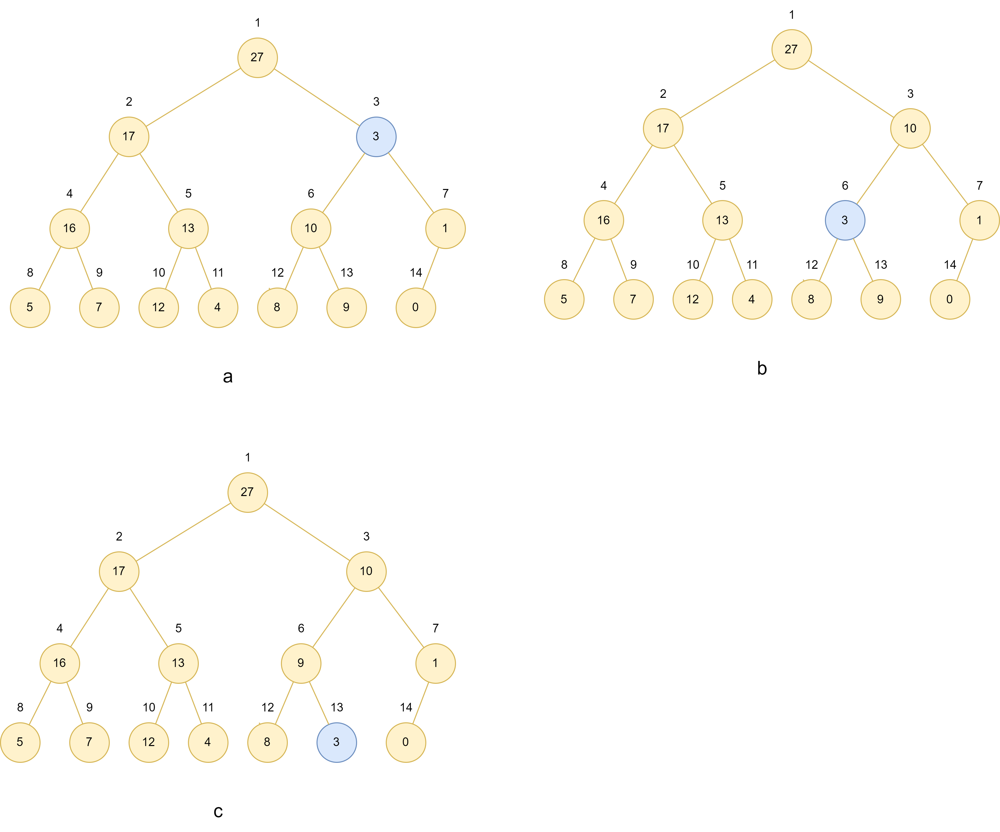

# 6.2 Maintaining the heap property

## 6.2-1

> Using Figure 6.2 as a model, illustrate the operation of **MAX-HEAPIFY(A,3)** on the array $A = < 27 , 17 , 3 , 16, 13, 10, 1, 5, 7, 12, 4, 8, 9, 0 >$.



## 6.2-2

> Show that each child of the root of an $n$-node heap is the root of a subtree containing at most $2n/3$ nodes. What is the smallest constant $\alpha$ such that each subtree has at $\alpha n$ nodes? How does that affect the recurrence (6.1) and its solution?

Let $\alpha n$ be the subtree's nodes number, if we want $\alpha$ to be maximum or mimimum, we need the tree to be most unbalanced. In this case, the left subtree is just full, the next node is to filled in right subtree. Let h be the height of the left subtree, it has $2^{h} - 1$ nodes, and the right has $2^{h-1} - 1$.

In this case, $n = 2^{h} - 1 + 2^{h-1} - 1 + 1$. The left subtree has $2^{h}-1$ nodes and the right subtree has $2^{h-1} -1$ nodes. a subtree containing at most $\frac{2^{h}-1}{2^{h}-1 + 2^{h-1} -1 + 1} \cdot n = \frac{2 * 2^{h-1}-1}{3 * 2^{h-1}-1}\cdot n \leq \frac{2n}{3}$ nodes. The right has at least $\frac{2^{h-1}-1}{2^{h}-1 + 2^{h-1} -1 + 1} \cdot n = \frac{ 2^{h-1}-1}{3 * 2^{h-1}-1}\cdot n = \frac{1}{3}(\frac{ 3*2^{h-1}-3}{3 * 2^{h-1}-1}\cdot n) = \frac{n}{3}(1 - \frac{2}{3 * 2^{h-1}-1}) = 0$ nodes, in which case the whole tree has 2 nodes. The left has at least $\frac{1}{3}$, in which case the whole tree has 3 nodes. The case $n = 1$ is omitted.

## 6.2-3

> Starting with the procedure **MAX-HEAPIFY**, write pseudocode for the procedure **MIN-HEAPIFY(A,i)**, which performs the corresponding manipulation on a minheap. How does the running time of **MIN-HEAPIFY** compare with that of **MIN-HEAPIFY**?

```cpp
MIN-HEAPIFY(A,i)
l = LEFT(i)
r = RIGHT(i)
smallest = i
if l < A.heap-size and A[l] < A[smallest]
    smallest = l
if r < A.heap-size and A[r] < A[smallest]
    smallest = r
if smallest != i
    swap(A[i],A[smallest])
        MIN-HEAPIFY(A,smallest)
```

the running time of **MIN-HEAPIFY** equal that of **MIN-HEAPIFY**?

## 6.2-4

> What is the effect of calling **MAX-HEAPIFY(A,i)** when the element $A[ i ]$ is larger than its children?

No effect. $A[i]$ is found to be largest and the procedure just returns.

## 6.2-5

> What is the effect of calling **MAX-HEAPIFY(A,i)** for $i > A$.*heap-size*$/2$?

No effect.

For program. Let $l$ be the left child of $i$ , and $r$ be the right. $l$ and $r$ is found to be larger than $A$.*heap-size*, then the procedure return.

For theory, i is a left since $i > A$.

## 6.2-6

> The code for **MAX-HEAPIFY** is quite efficient in terms of constant factors, except possibly for the recursive call in line 10, for which some compilers might produce inefficient code. Write an efficient MAX-HEAPIFY that uses an iterative control construct (a loop) instead of recursion.

```cpp
MAX-HEAPIFY(A,i)
l = LEFT(i)
r = RIGHT(i)
largest = i
if l > A.heap-size and A[l] > A[largest]
    largest = l
if r > A.heap-size and A[r] > A[largest]
    largest = r
while(largest != i)
    swap(A[i],A[largest])
        MIN-HEAPIFY(A,largest)
    l = LEFT(i)
    r = RIGHT(i)
    largest = i
    if l > A.heap-size and A[l] > A[largest]
        largest = l
    if r > A.heap-size and A[r] > A[largest]
        largest = r
```

## 6.2-7

> Show that the worst-case running time of **MAX-HEAPIFY** on a heap of size $n$ is $\Omega(\lg n)$.  (*Hint*: For a heap with $n$ nodes, give node values that cause **MAX-HEAPIFY** to be called recursively at every node on a simple path from the root down to a leaf.)

Worst case: the element in root node is swapped through each level until it is a leaf. The height of the heap is $\lfloor \lg n \rfloor$, so the worst-case running time of **MAX-HEAPIFY** on a heap of size $n$ is $\Omega(\lg n)$.
