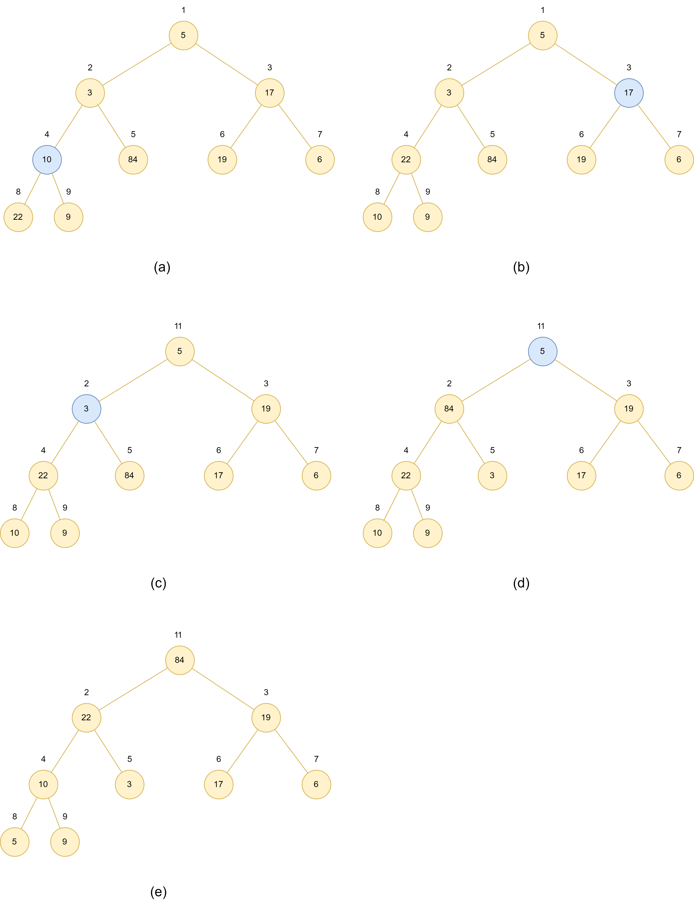

# 6.3 Building a heap

## 6.3-1

> Using Figure 6.3 as a model, illustrate the operation of **BUILD-MAX-HEAP** on the array $A = < 5, 3, 17, 10, 84, 19, 6, 22, 9 >$.

## 6.3-2

> Show that $\lceil n / 2^{h+1} \rceil \geq 1/2$ for $0 \leq h \leq \lfloor \lg n \rfloor$.

$$
\begin{aligned}
    \lceil n / 2^{h+1} \rceil
    & \geq \lceil n / 2^{\lfloor \lg n \rfloor+1} \rceil\cr
    & \geq \lceil n / 2^{\lg n+1} \rceil\cr
    & = \lceil n / 2^{\lg n+1} \rceil\cr
    & \geq \lceil 1 / 2 \rceil\cr
    & \geq 1/2\cr
\end{aligned}
$$

## 6.3-3

> Why does the loop index $i$ in line 2 of **BUILD-MAX-HEAP** decrease from $\lfloor n/2 \rfloor$ to 1  rather than increase from 1 to $\lfloor n/2 \rfloor$?

Because the procudure **MAX-HEAPIFY(A,i)** called in **BUILD-MAX-HEAP** work exactly while its assumption that the childs of $A [ i ]$ is the root of a **MAX-HEAP** is true.

When the loop index $i$ in line 2 of **BUILD-MAX-HEAP** decrease from $\lfloor n/2 \rfloor$ to 1, it can ensure the assumption of **MAX-HEAPIFY(A,i)** before calling it, since the leaves' indexs are $\lfloor n/2 \rfloor + 1 , \lfloor n/2 \rfloor + 2,...,n$.

But if the loop index $i$ in line 2 of **BUILD-MAX-HEAP** increase from 1 to $\lfloor n/2 \rfloor$?, we can not ecsure the assumption is true. For instance, $A=<3,2,1,4,5>$.

## 6.3-4

> Show that there are at most $\lceil n / 2^{h+1} \rceil$ nodes of height $h$ in any $n$-element heap.

Let $N_{h}$ be the numbers of nodes of height $h$.

$$
\begin{aligned}
    \text{base case:}\cr
    n_{0} & = n - \lfloor n / 2 \rfloor\text{(6.1-8)}\cr
    & = \lceil n / 2 \rceil\cr
    \text{inductive case: }\cr
    \text{assume: } n_{h-1} & \leq \lceil n / 2^{h} \rceil\cr
    \text{if } n_{h-1} & = 2 n_{h}\cr
    n_{h} & = n_{h-1}/2\cr
    & \leq \lceil n / 2^{h} \rceil /2\cr
    & \leq \lceil n / 2^{h+1} \rceil\cr
    \text{if } n_{h-1} & = 2 n_{h}-1\cr
    n_{h} & = \frac{n_{h-1}+1}{2}\cr
    & =\left\lceil\frac{n_{h-1}}{2}\right\rceil\cr
    & \leq \left\lceil\frac{\lceil n / 2^{h} \rceil}{2}\right\rceil\cr
    & \leq \lceil n / 2^{h+1} \rceil\cr
\end{aligned}
$$

$n_{h} \leq \lceil n / 2^{h+1} \rceil$ holds for all $h\geq 0$.
