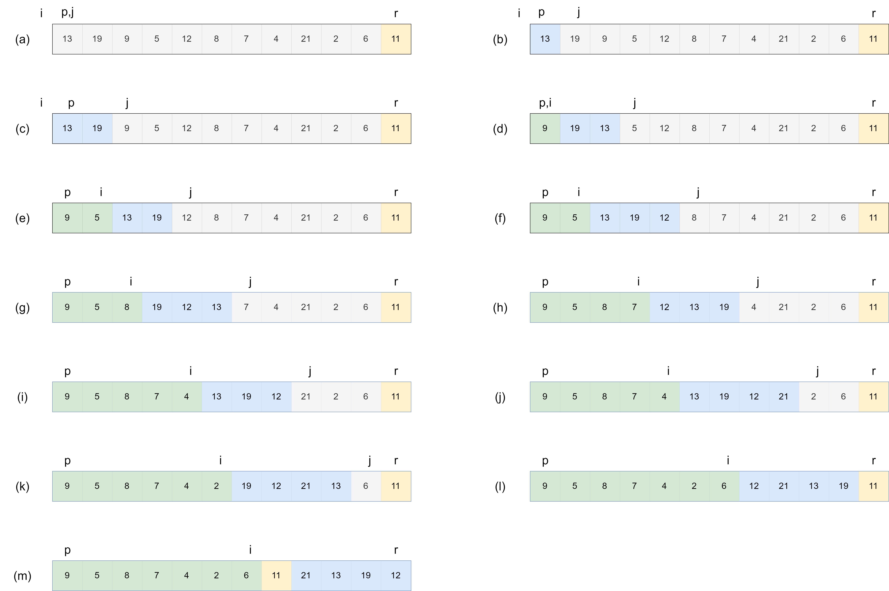

# Description of quicksort

## 7.1-1

> Using Figure 7.1 as a model, illustrate the operation of **PARTITION** on the array $A = <13, 19, 9, 5, 12, 8, 7, 4, 21, 2, 6, 11>$.



## 7.1-2

> What value of $q$ does **PARTITION** return when all elements in the subarray $A[ p : r ]$ have the same value? Modify **PARTITION** so that $q = \lfloor (p+r)/2 \rfloor$ when all elements in the subarray $A[p:r]$ have the same value.

$q = r$;

We can modify **PARTITION** to assign the elements have same value with $A[r]$ to low side and high side alternately.

```cpp
PARTITION-MODIFY(A,p,r)
x = A[r]
i = p-1
flag = 0
for j = p to r-1
    if A[j] < x
        i = i + 1
        exchange A[i] with A[j]
    else if A[j] = x
        if (flag = 1)//whether A[i] assigned to low side
            i = i + 1
            exchange A[i] with A[j]
            flag = (flag + 1)%2//flag = (flag+1)mod2
exchange A[i+1] with A[r]
return i+1
```

## 7.1-3

> Give a brief argument that the running time of **PARTITION** on a subarray of size $n$ is $\Theta(n)$.

The running time of **PARTITION** is domained by `for` loop. So it is $\Theta(r-q)=\Theta(n)$

## 7.1-4

> Modify **QUICKSORT** to sort into monotonically decreasing order.

```cpp
PARTITION-MODIFY(A,p,r)
x = A[r]
i = p-1
for j = p to r-1
    if A[j] >= x//only changement
        i = i + 1
        exchange A[i] with A[j]
exchange A[i+1] with A[r]
return i+1
```
